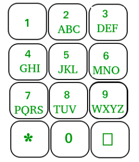

## 1. Josephus Problem (AMAZON)
[Problem Link](https://www.geeksforgeeks.org/josephus-problem-set-1-a-on-solution/)

___

## 2. Lucky Numebrs (Microsoft)
### Problem Statement - 
> Given a number. Check if it is lucky or not.
> **Lucky Number** - It is a subset of series of integers. Observe the following :
* Let's consider 1, 2, 3, 4, 5, 6, 7, 8, 9, 10, 11, 12, 13, 14, 15, 16, 17, 18, 19,..................
* In first iteration
    * Remove the second integers
    * Result - 1, 3, 5, 7, 9, 11, 13, 15, 17, 19,..................
* In second iteration
    * Remove the third integers
    * Result - 1, 3, 7, 9, 13, 15, 19,...........
* And so on..
* The number which is in this series is the Lucky Numebr.
### Input Format - 
* 2
* 5
* 19
## Output Format - 
* 0 (True)
* 1 (False)

### Psuedocode - 
> Here we need to find the postion(P) of the numebr in every iteration. The counter / iteration(I) initially was given 2.
> If I > P then it is a lucky numebr. And also if the N divided by the counter(I) return false.

```C++
bool Lucky(int n, &counter) {
    int pos = n; //Initally pos is n.
    if( counter < I ) return 1;
    if( n % counter == 0) return 0;

    pos -= (pos / counter);
    counter++;

    return Lucky(pos, counter);
}

```
### Time Complexity - 
> O( sqrt(N) )
### Reference Link - 
[Lucky Numbers](https://www.geeksforgeeks.org/lucky-numbers/)

___
## 3. Power Of Numbers (makemytrip, walmart)
### Problem Statement - 
> Given a number N and reverse of it R. Compute power(N, R). The values are very big so return answer with modulo 1e9+7.
### Input Format -
* 2
* 2
* 12
### Output Format -
* 4
* 864354781

### Psuedocode -
> For pow(a,b) if b is even then the pow(a,b) = pow(a, b/2) * pow(a, b/2)

> For Pow(a,b) if b is odd, then the pow(a,b) = a * pow(a, b-1)

```C++
int M = 1000000007;
long long power(int N, int R) {
    if(R == 0) return 1;
    if(R % 2 == 0) 
        return ((power(N, R/2)) % M * (power(N, R/2)) % M) % M;
    else
        return (N * power(N, R - 1)% M) % M;
}
```

### Time Complexity - 
> O( LogN )

___
## 4. PowerSet of a string lexicographical
### Input Format -
* 2
* a
* abc
### Output Fromat - 
* a
* a ab abc ac b bc c
### Psuedocode -
```Java
    static ArrayList<String> set(String s, int idx, String curr, ArrayList<String> ans) {
        int n = s.length();
        if(idx == n) {
            ans.add(curr);
            return ans;
        }
        ans = set(s, idx+1, curr, ans);
        ans = set(s, idx+1, curr+s.charAt(idx), ans);
        return ans;
    }
    static ArrayList<String> powerSet(String s)
    {
        ArrayList<String> a = new ArrayList<>();
        a = set(s, 0, "", a);
        return a;
    }
```
### Time Complexity -
> O(2 ^ N)

___

## 5. Possible words from phone digits (Amazon, flipkart)
### Problem statement -
> Given a keypad as shown in diagram, and an N digit number. List all words which are possible by pressing these numbers.
 

### Input Format - 
* 2
* 3
* 2 3 4
* 3
* 3 4 5
### Output Format - 
* adg adh adi aeg aeh aei afg afh afi bdg bdh bdi beg beh bei bfg bfh bfi cdg cdh cdi ceg ceh cei cfg cfh cfi
* dgj dgk dgl dhj dhk dhl dij dik dil egj egk egl ehj ehk ehl eij eik eil fgj fgk fgl fhj fhk fhl fij fik fil

### Psuedocode -
```Java
class PhoneDigit
{
    public static ArrayList<String> alpha = new ArrayList<>();
    public static ArrayList<String> generateStrings(int ar[], int n, int idx, ArrayList<String> ans, String curr) {
        if(idx == n){
                ans.add(curr);
            return ans;
        }
        for(int i = 0; i < alpha.get(ar[idx]).length(); i++) {
            curr += alpha.get(ar[idx]).charAt(i);
            generateStrings(ar, n, idx+1, ans, curr);
            
            if(curr.length() != 0){
                curr = curr.substring(0, curr.length()-1);
            }
            if(ar[idx] == 0 || ar[idx] == 1) return ans;
        }
        return ans;
    }
    static ArrayList <String> possibleWords(int a[], int N)
    {
        // your code here  
       
        alpha.add(" ");
        alpha.add(" ");
        alpha.add("abc");
        alpha.add("def");
        alpha.add("ghi");
        alpha.add("jkl");
        alpha.add("mno");
        alpha.add("pqrs");
        alpha.add("tuv");
        alpha.add("wxyz");
        
        String curr = "";
        ArrayList<String> ans = new ArrayList<>();
        int idx = 0;
        ans = generateStrings(a, N, idx, ans, curr);
        return ans;
    }
}
```
### Time Complexity -
> O( 4^N )